# Diagramas del piloto de Cuautla

## 1. Contexto del sistema

Vista del piloto implementado; no representa operación municipal real.

Fuente: `apps/mobile/lib; apps/admin/src; supabase/functions`.

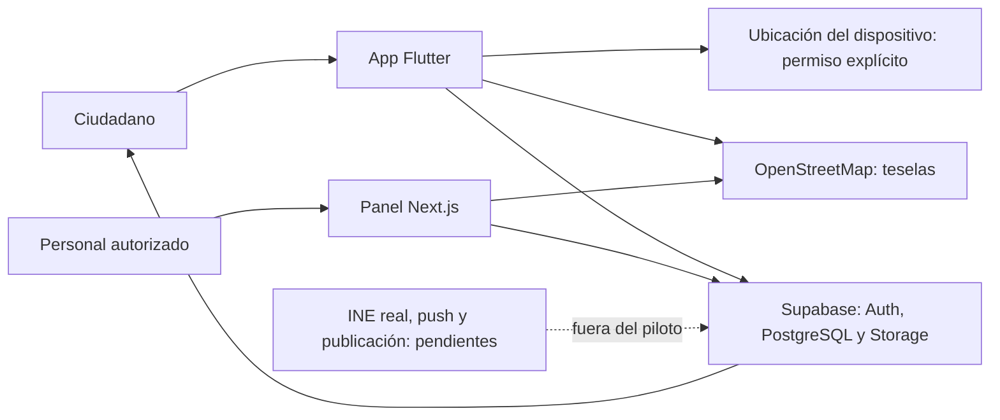
```mermaid
flowchart LR
 C[Ciudadano] --> F[App Flutter]
 A[Personal autorizado] --> N[Panel Next.js]
 F --> S[Supabase: Auth, PostgreSQL y Storage]
 N --> S
 F --> L[Ubicación del dispositivo: permiso explícito]
 F --> M[OpenStreetMap: teselas]
 N --> M
 S --> C
 P[INE real, push y publicación: pendientes] -. fuera del piloto .-> S
```

## 2. Contenedores y canales reales

Las notificaciones son RPC y triggers; no hay FCM ni suscripción Realtime implementada en este flujo.

Fuente: `report_repository.dart; api.ts; supabase/functions`.

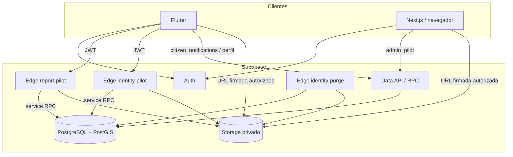
```mermaid
flowchart TB
 subgraph Clientes
 F[Flutter]
 N[Next.js / navegador]
 end
 subgraph Supabase
 A[Auth]
 E[Edge report-pilot]
 I[Edge identity-pilot]
 R[Data API / RPC]
 D[(PostgreSQL + PostGIS)]
 S[(Storage privado)]
 P[Edge identity-purge]
 end
 F --> A
 N --> A
 F -->|JWT| E
 F -->|JWT| I
 F -->|citizen_notifications / perfil| R
 N -->|admin_pilot| R
 E -->|service RPC| D
 I -->|service RPC| D
 R --> D
 E --> S
 I --> S
 N -->|URL firmada autorizada| S
 F -->|URL firmada autorizada| S
 P --> D
 P --> S
```

## 3. Componentes de la app ciudadana

Nombres de clases y dependencias presentes en el código.

Fuente: `apps/mobile/lib`.

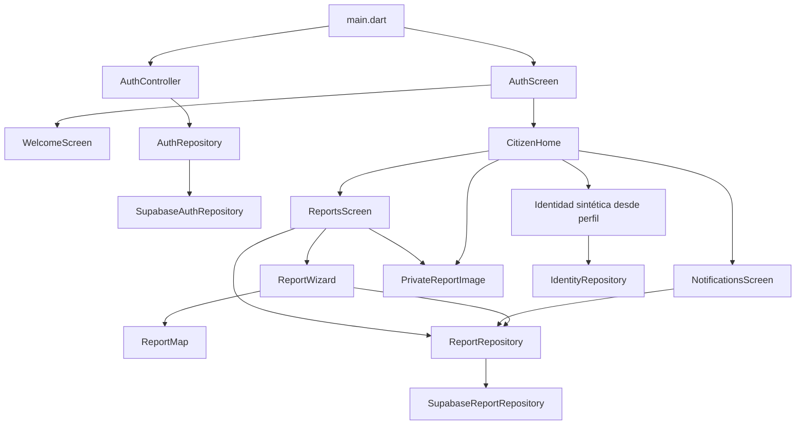
```mermaid
flowchart TB
 Main[main.dart] --> AuthController
 Main --> AuthScreen
 AuthScreen --> WelcomeScreen
 AuthScreen --> CitizenHome
 AuthController --> AuthRepository
 AuthRepository --> SupabaseAuthRepository
 CitizenHome --> ReportsScreen
 CitizenHome --> NotificationsScreen
 CitizenHome --> IdentityScreen[Identidad sintética desde perfil]
 ReportsScreen --> ReportWizard
 ReportWizard --> ReportMap
 ReportsScreen --> PrivateReportImage
 CitizenHome --> PrivateReportImage
 ReportsScreen --> ReportRepository
 NotificationsScreen --> ReportRepository
 ReportWizard --> ReportRepository
 ReportRepository --> SupabaseReportRepository
 IdentityScreen --> IdentityRepository
```

## 4. Componentes del panel

Arquitectura de módulos; los componentes React no son clases de dominio.

Fuente: `apps/admin/src/app; apps/admin/src/lib/api.ts`.

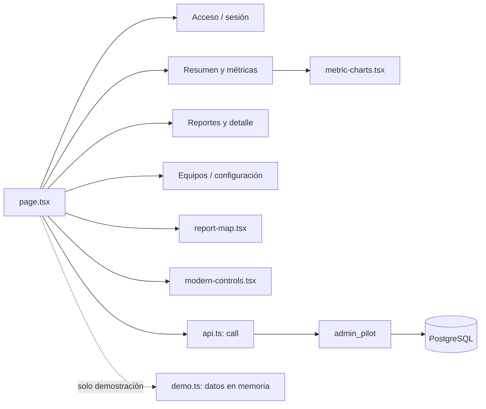
```mermaid
flowchart LR
 Page[page.tsx] --> Login[Acceso / sesión]
 Page --> Summary[Resumen y métricas]
 Page --> Reports[Reportes y detalle]
 Page --> Teams[Equipos / configuración]
 Page --> Map[report-map.tsx]
 Page --> Controls[modern-controls.tsx]
 Summary --> Charts[metric-charts.tsx]
 Page --> API[api.ts: call]
 API --> RPC[admin_pilot]
 Page -. solo demostración .-> Demo[demo.ts: datos en memoria]
 RPC --> DB[(PostgreSQL)]
```

## 5. Despliegue actual y distribución

Despliegue local documentado; no se afirma que los servidores estén activos ni se dibuja hosting público inexistente.

Fuente: `scripts/serve-mobile.mjs; CONTRIBUTING.md; docs/fase-5-administracion.md`.

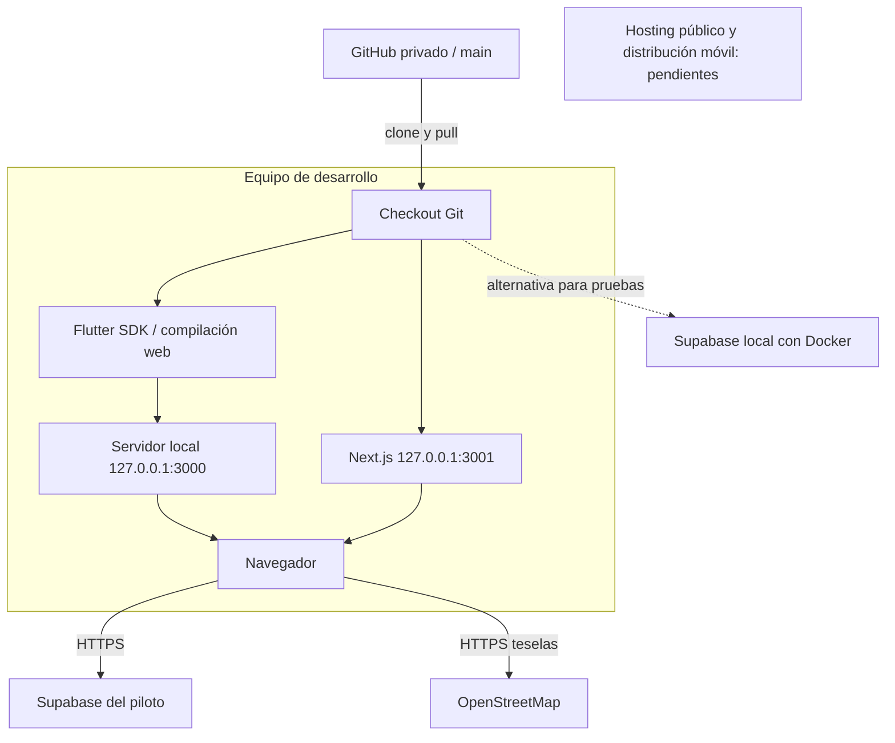
```mermaid
flowchart TB
 subgraph Equipo[Equipo de desarrollo]
 Git[Checkout Git]
 Flutter[Flutter SDK / compilación web]
 Web[Servidor local 127.0.0.1:3000]
 Next[Next.js 127.0.0.1:3001]
 Browser[Navegador]
 Git --> Flutter --> Web --> Browser
 Git --> Next --> Browser
 end
 GitHub[GitHub privado / main] -->|clone y pull| Git
 Browser -->|HTTPS| Cloud[Supabase del piloto]
 Browser -->|HTTPS teselas| OSM[OpenStreetMap]
 Git -. alternativa para pruebas .-> Docker[Supabase local con Docker]
 Pending[Hosting público y distribución móvil: pendientes]
```

## 6. Casos de uso y actores

Notación de casos de uso aproximada con nodos Mermaid. Las facultades concretas dependen del permiso, municipio y estado.

Fuente: `auth_repository.dart; admin_pilot migration; report_pilot migration`.

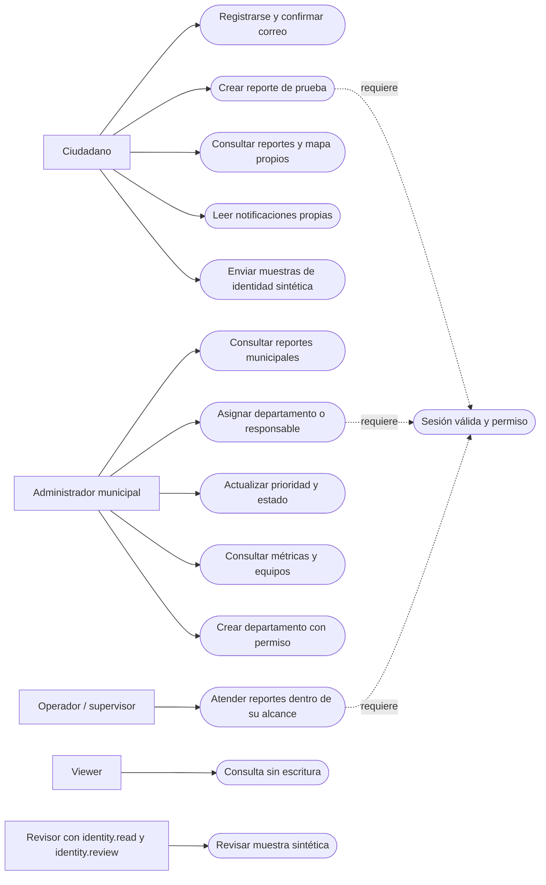
```mermaid
flowchart LR
 C[Ciudadano] --> UC1([Registrarse y confirmar correo])
 C --> UC2([Crear reporte de prueba])
 C --> UC3([Consultar reportes y mapa propios])
 C --> UC4([Leer notificaciones propias])
 C --> UC5([Enviar muestras de identidad sintética])
 A[Administrador municipal] --> UA1([Consultar reportes municipales])
 A --> UA2([Asignar departamento o responsable])
 A --> UA3([Actualizar prioridad y estado])
 A --> UA4([Consultar métricas y equipos])
 A --> UA5([Crear departamento con permiso])
 O[Operador / supervisor] --> UO([Atender reportes dentro de su alcance])
 V[Viewer] --> UV([Consulta sin escritura])
 R[Revisor con identity.read y identity.review] --> UR([Revisar muestra sintética])
 UC2 -. requiere .-> AU([Sesión válida y permiso])
 UA2 -. requiere .-> AU
 UO -. requiere .-> AU
```

## 7. Clases de autenticación Flutter

Firmas resumidas; atributos y dependencias reales.

Fuente: `apps/mobile/lib/features/auth/domain/auth_repository.dart; application/auth_controller.dart`.

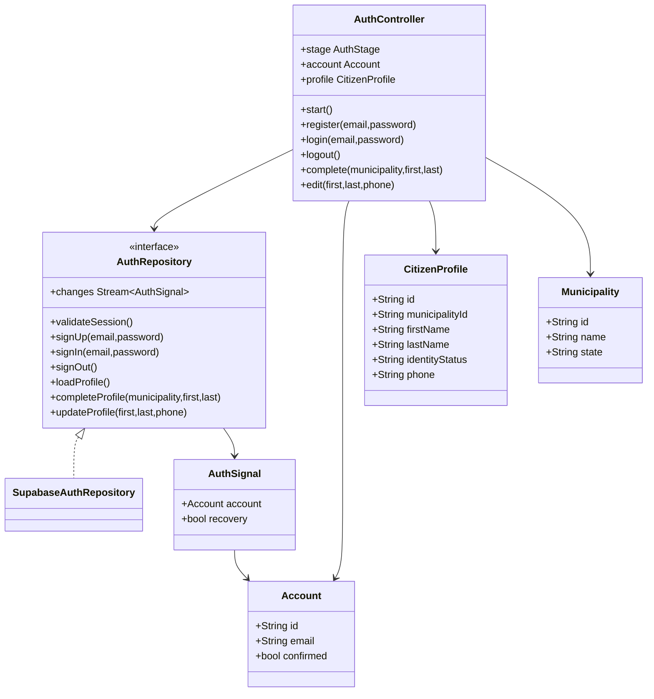
```mermaid
classDiagram
 class AuthRepository {
 <<interface>>
 +changes Stream~AuthSignal~
 +validateSession()
 +signUp(email,password)
 +signIn(email,password)
 +signOut()
 +loadProfile()
 +completeProfile(municipality,first,last)
 +updateProfile(first,last,phone)
 }
 class SupabaseAuthRepository
 class AuthController {
 +stage AuthStage
 +account Account
 +profile CitizenProfile
 +start()
 +register(email,password)
 +login(email,password)
 +logout()
 +complete(municipality,first,last)
 +edit(first,last,phone)
 }
 class Account {
 +String id
 +String email
 +bool confirmed
 }
 class CitizenProfile {
 +String id
 +String municipalityId
 +String firstName
 +String lastName
 +String identityStatus
 +String phone
 }
 class AuthSignal {
 +Account account
 +bool recovery
 }
 class Municipality {
 +String id
 +String name
 +String state
 }
 AuthRepository <|.. SupabaseAuthRepository
 AuthController --> AuthRepository
 AuthController --> Account
 AuthController --> CitizenProfile
 AuthController --> Municipality
 AuthRepository --> AuthSignal
 AuthSignal --> Account
```

## 8. Clases del módulo de reportes

Los reportes se transportan como Map JSON; no se inventa una clase Report en Flutter.

Fuente: `apps/mobile/lib/features/reports`.

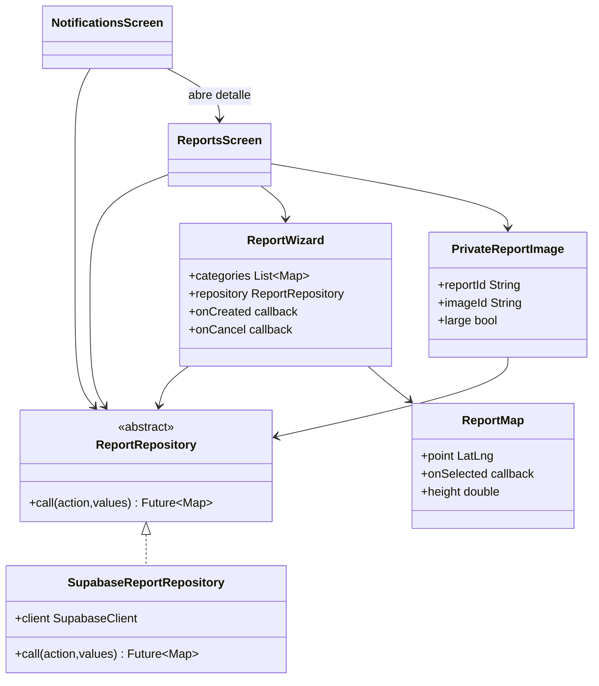
```mermaid
classDiagram
 class ReportRepository {
 <<abstract>>
 +call(action,values) Future~Map~
 }
 class SupabaseReportRepository {
 +client SupabaseClient
 +call(action,values) Future~Map~
 }
 class ReportsScreen
 class ReportWizard {
 +categories List~Map~
 +repository ReportRepository
 +onCreated callback
 +onCancel callback
 }
 class ReportMap {
 +point LatLng
 +onSelected callback
 +height double
 }
 class PrivateReportImage {
 +reportId String
 +imageId String
 +large bool
 }
 class NotificationsScreen
 ReportRepository <|.. SupabaseReportRepository
 ReportsScreen --> ReportRepository
 ReportsScreen --> ReportWizard
 ReportsScreen --> PrivateReportImage
 ReportWizard --> ReportRepository
 ReportWizard --> ReportMap
 PrivateReportImage --> ReportRepository
 NotificationsScreen --> ReportRepository
 NotificationsScreen --> ReportsScreen : abre detalle
```

## 9. Estados de sesión

Representación del AuthController; loading también se usa al aceptar cambios de sesión.

Fuente: `apps/mobile/lib/features/auth/application/auth_controller.dart`.

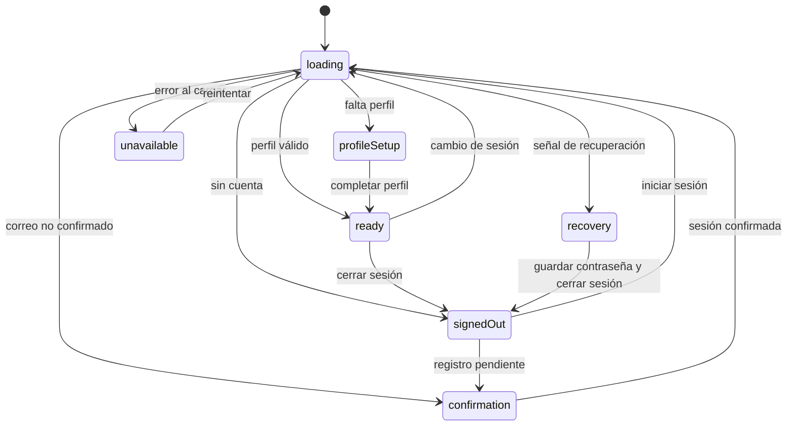
```mermaid
stateDiagram-v2
 [*] --> loading
 loading --> signedOut: sin cuenta
 loading --> confirmation: correo no confirmado
 loading --> profileSetup: falta perfil
 loading --> ready: perfil válido
 loading --> recovery: señal de recuperación
 loading --> unavailable: error al cargar
 signedOut --> confirmation: registro pendiente
 signedOut --> loading: iniciar sesión
 confirmation --> loading: sesión confirmada
 profileSetup --> ready: completar perfil
 ready --> signedOut: cerrar sesión
 ready --> loading: cambio de sesión
 recovery --> signedOut: guardar contraseña y cerrar sesión
 unavailable --> loading: reintentar
```

## 10. Registro y perfil

No se conceden roles administrativos desde metadatos del registro.

Fuente: `auth_controller.dart; supabase_auth_repository.dart; phase2_auth_profiles.sql`.

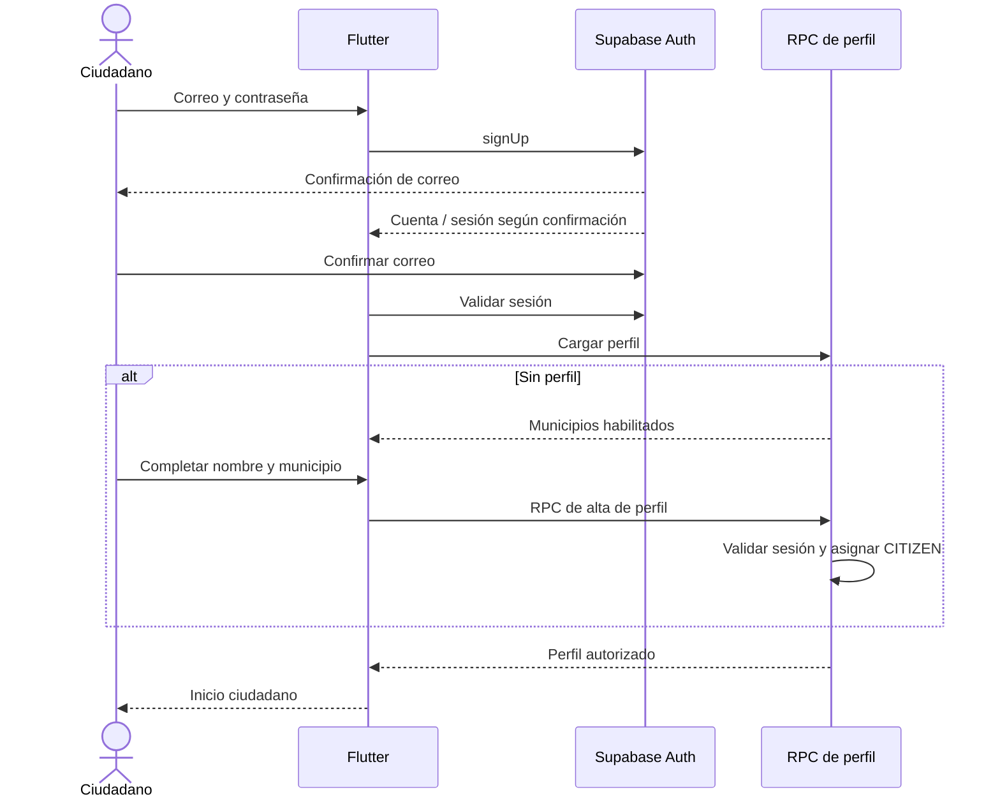
```mermaid
sequenceDiagram
 actor C as Ciudadano
 participant UI as Flutter
 participant A as Supabase Auth
 participant DB as RPC de perfil
 C->>UI: Correo y contraseña
 UI->>A: signUp
 A-->>C: Confirmación de correo
 A-->>UI: Cuenta / sesión según confirmación
 C->>A: Confirmar correo
 UI->>A: Validar sesión
 UI->>DB: Cargar perfil
 alt Sin perfil
 DB-->>UI: Municipios habilitados
 C->>UI: Completar nombre y municipio
 UI->>DB: RPC de alta de perfil
 DB->>DB: Validar sesión y asignar CITIZEN
 end
 DB-->>UI: Perfil autorizado
 UI-->>C: Inicio ciudadano
```

## 11. Actividad: crear reporte

Dirección de diez caracteres o punto geográfico cuando la categoría exige ubicación; máximo tres fotos en el piloto.

Fuente: `report_wizard.dart; report_address_location.sql`.

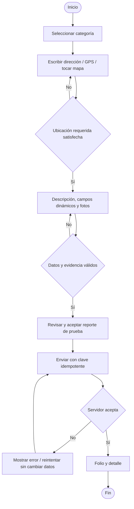
```mermaid
flowchart TD
 A([Inicio]) --> B[Seleccionar categoría]
 B --> C[Escribir dirección / GPS / tocar mapa]
 C --> D{Ubicación requerida satisfecha}
 D -->|No| C
 D -->|Sí| E[Descripción, campos dinámicos y fotos]
 E --> F{Datos y evidencia válidos}
 F -->|No| E
 F -->|Sí| G[Revisar y aceptar reporte de prueba]
 G --> H[Enviar con clave idempotente]
 H --> I{Servidor acepta}
 I -->|No| J[Mostrar error / reintentar sin cambiar datos]
 J --> H
 I -->|Sí| K[Folio y detalle]
 K --> L([Fin])
```

## 12. Envío de reporte y evidencia

Reserva y commit son transacciones separadas; Storage no comparte transacción SQL. La reserva permite reintentos y purga de cargas incompletas.

Fuente: `supabase/functions/report-pilot/index.ts; phase4_report_list_alias.sql`.

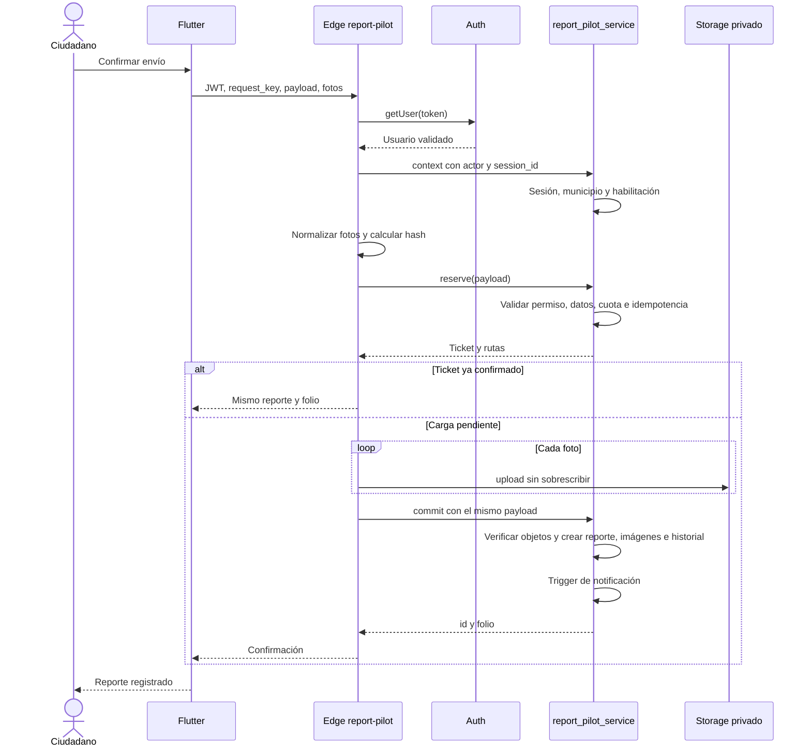
```mermaid
sequenceDiagram
 actor C as Ciudadano
 participant F as Flutter
 participant E as Edge report-pilot
 participant A as Auth
 participant DB as report_pilot_service
 participant S as Storage privado
 C->>F: Confirmar envío
 F->>E: JWT, request_key, payload, fotos
 E->>A: getUser(token)
 A-->>E: Usuario validado
 E->>DB: context con actor y session_id
 DB->>DB: Sesión, municipio y habilitación
 E->>E: Normalizar fotos y calcular hash
 E->>DB: reserve(payload)
 DB->>DB: Validar permiso, datos, cuota e idempotencia
 DB-->>E: Ticket y rutas
 alt Ticket ya confirmado
 E-->>F: Mismo reporte y folio
 else Carga pendiente
 loop Cada foto
 E->>S: upload sin sobrescribir
 end
 E->>DB: commit con el mismo payload
 DB->>DB: Verificar objetos y crear reporte, imágenes e historial
 DB->>DB: Trigger de notificación
 DB-->>E: id y folio
 E-->>F: Confirmación
 end
 F-->>C: Reporte registrado
```

## 13. Máquina de estados del reporte

Transiciones reales de admin_pilot; VALIDADO avanza mediante asignación, no mediante el selector de estado.

Fuente: `20260926004537_phase5_admin_pilot.sql; apps/admin/src/lib/api.ts`.

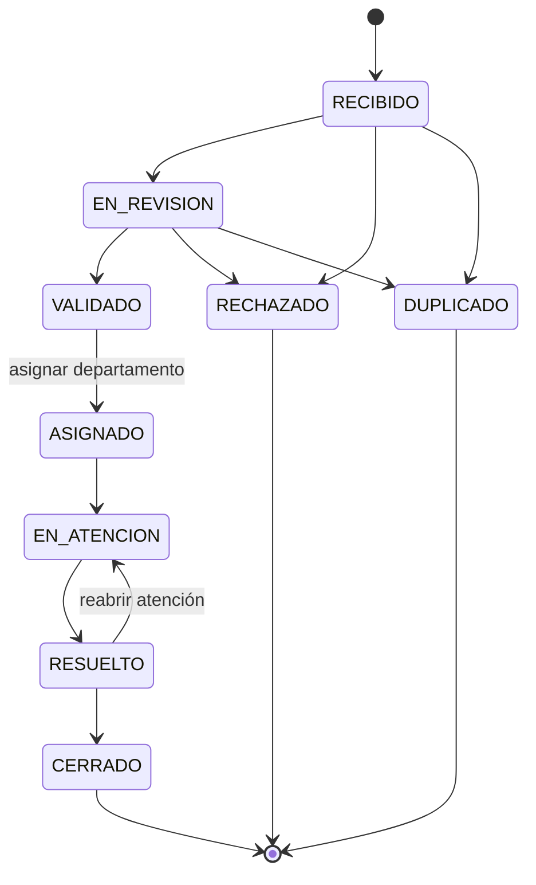
```mermaid
stateDiagram-v2
 [*] --> RECIBIDO
 RECIBIDO --> EN_REVISION
 RECIBIDO --> RECHAZADO
 RECIBIDO --> DUPLICADO
 EN_REVISION --> VALIDADO
 EN_REVISION --> RECHAZADO
 EN_REVISION --> DUPLICADO
 VALIDADO --> ASIGNADO: asignar departamento
 ASIGNADO --> EN_ATENCION
 EN_ATENCION --> RESUELTO
 RESUELTO --> EN_ATENCION: reabrir atención
 RESUELTO --> CERRADO
 CERRADO --> [*]
 RECHAZADO --> [*]
 DUPLICADO --> [*]
```

## 14. Actualización administrativa y concurrencia

El backend compara admin_version y bloquea cambios sobre estados terminales.

Fuente: `20260926004537_phase5_admin_pilot.sql`.

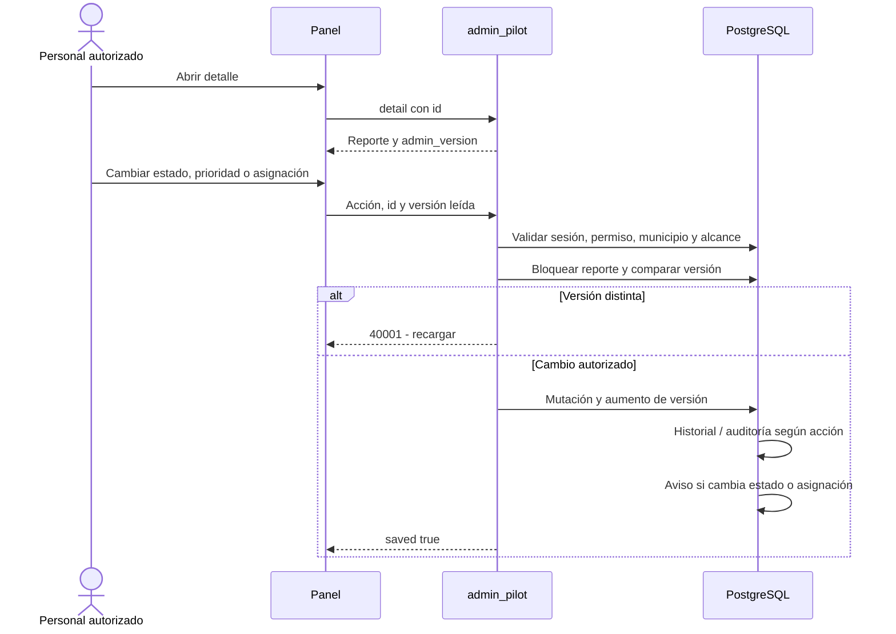
```mermaid
sequenceDiagram
 actor O as Personal autorizado
 participant P as Panel
 participant R as admin_pilot
 participant DB as PostgreSQL
 O->>P: Abrir detalle
 P->>R: detail con id
 R-->>P: Reporte y admin_version
 O->>P: Cambiar estado, prioridad o asignación
 P->>R: Acción, id y versión leída
 R->>DB: Validar sesión, permiso, municipio y alcance
 R->>DB: Bloquear reporte y comparar versión
 alt Versión distinta
 R-->>P: 40001 - recargar
 else Cambio autorizado
 R->>DB: Mutación y aumento de versión
 DB->>DB: Historial / auditoría según acción
 DB->>DB: Aviso si cambia estado o asignación
 R-->>P: saved true
 end
```

## 15. Notificaciones internas

No existe envío push; la bandeja se actualiza mediante RPC. La prioridad por sí sola no genera aviso.

Fuente: `phase6_notifications.sql; notifications_screen.dart; citizen_home.dart`.

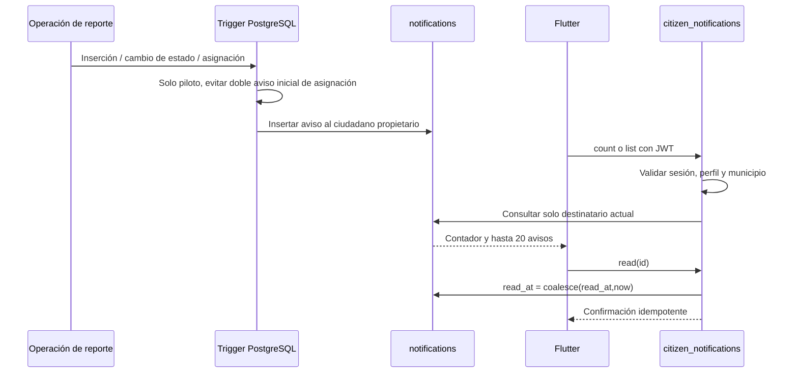
```mermaid
sequenceDiagram
 participant B as Operación de reporte
 participant T as Trigger PostgreSQL
 participant N as notifications
 participant F as Flutter
 participant R as citizen_notifications
 B->>T: Inserción / cambio de estado / asignación
 T->>T: Solo piloto, evitar doble aviso inicial de asignación
 T->>N: Insertar aviso al ciudadano propietario
 F->>R: count o list con JWT
 R->>R: Validar sesión, perfil y municipio
 R->>N: Consultar solo destinatario actual
 N-->>F: Contador y hasta 20 avisos
 F->>R: read(id)
 R->>N: read_at = coalesce(read_at,now)
 R-->>F: Confirmación idempotente
```

## 16. Acceso privado a fotografías

Flujo ciudadano. El panel también solicita acceso firmado, por su propia ruta autorizada.

Fuente: `report-pilot/index.ts; reports_screen.dart`.

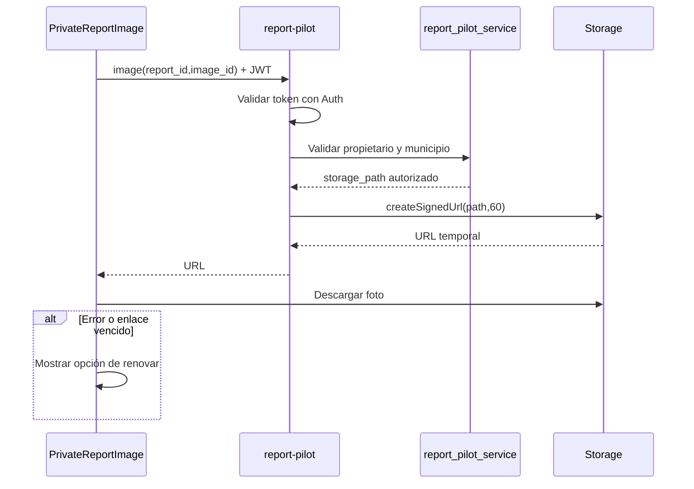
```mermaid
sequenceDiagram
 participant UI as PrivateReportImage
 participant E as report-pilot
 participant R as report_pilot_service
 participant S as Storage
 UI->>E: image(report_id,image_id) + JWT
 E->>E: Validar token con Auth
 E->>R: Validar propietario y municipio
 R-->>E: storage_path autorizado
 E->>S: createSignedUrl(path,60)
 S-->>E: URL temporal
 E-->>UI: URL
 UI->>S: Descargar foto
 alt Error o enlace vencido
 UI->>UI: Mostrar opción de renovar
 end
```

## 17. Estados de identidad sintética

Aprobar la simulación NO marca VERIFIED al perfil. VERIFIED y EXPIRED existen en el enum, pero no son resultados de este piloto.

Fuente: `20260924170343_phase3_synthetic_identity.sql`.

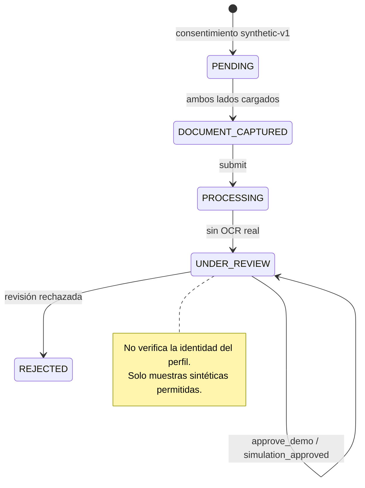
```mermaid
stateDiagram-v2
 [*] --> PENDING: consentimiento synthetic-v1
 PENDING --> DOCUMENT_CAPTURED: ambos lados cargados
 DOCUMENT_CAPTURED --> PROCESSING: submit
 PROCESSING --> UNDER_REVIEW: sin OCR real
 UNDER_REVIEW --> UNDER_REVIEW: approve_demo / simulation_approved
 UNDER_REVIEW --> REJECTED: revisión rechazada
 note right of UNDER_REVIEW
   No verifica la identidad del perfil.
   Solo muestras sintéticas permitidas.
 end note
```

## 18. Purga programada de archivos

La migración programa cada 15 minutos; no se consultó el estado actual del cron remoto. No borra automáticamente evidencia de reportes confirmados.

Fuente: `identity-purge/index.ts; phase3_purge_schedule.sql; phase4_pilot_reports.sql`.

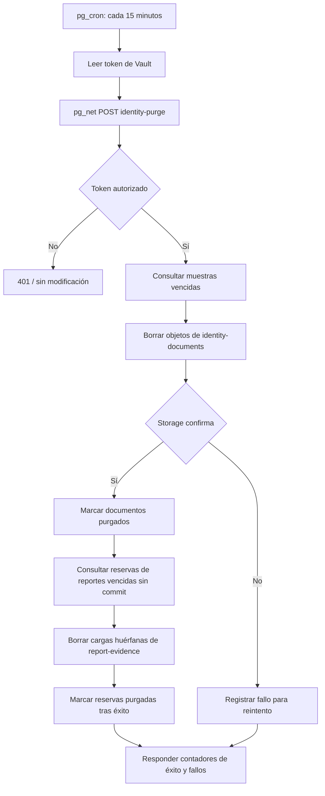
```mermaid
flowchart TD
 C[pg_cron: cada 15 minutos] --> V[Leer token de Vault]
 V --> H[pg_net POST identity-purge]
 H --> A{Token autorizado}
 A -->|No| X[401 / sin modificación]
 A -->|Sí| I[Consultar muestras vencidas]
 I --> D[Borrar objetos de identity-documents]
 D --> F{Storage confirma}
 F -->|Sí| M[Marcar documentos purgados]
 F -->|No| R[Registrar fallo para reintento]
 M --> U[Consultar reservas de reportes vencidas sin commit]
 U --> E[Borrar cargas huérfanas de report-evidence]
 E --> P[Marcar reservas purgadas tras éxito]
 P --> O[Responder contadores de éxito y fallos]
 R --> O
```

## 19. Decisión de autorización

Diagrama conceptual de controles combinados; cada RPC realiza los controles específicos de su operación.

Fuente: `phase1_security.sql; phase4_pilot_reports.sql; phase5_admin_pilot.sql; phase6_notifications.sql`.

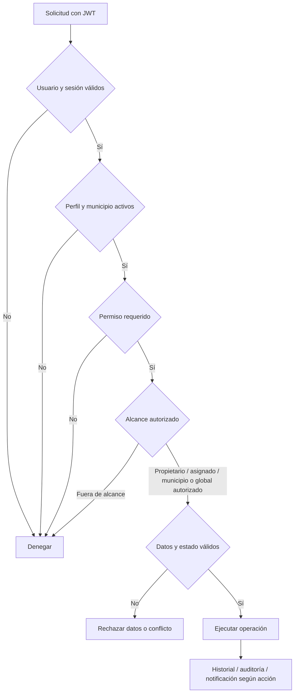
```mermaid
flowchart TD
 A[Solicitud con JWT] --> B{Usuario y sesión válidos}
 B -->|No| X[Denegar]
 B -->|Sí| C{Perfil y municipio activos}
 C -->|No| X
 C -->|Sí| D{Permiso requerido}
 D -->|No| X
 D -->|Sí| E{Alcance autorizado}
 E -->|Propietario / asignado / municipio o global autorizado| F{Datos y estado válidos}
 E -->|Fuera de alcance| X
 F -->|No| Y[Rechazar datos o conflicto]
 F -->|Sí| G[Ejecutar operación]
 G --> H[Historial / auditoría / notificación según acción]
```

## 20. Navegación ciudadana

Vista funcional; no representa cada control ni cada ruta técnica.

Fuente: `auth_screen.dart; citizen_home.dart; reports_screen.dart`.

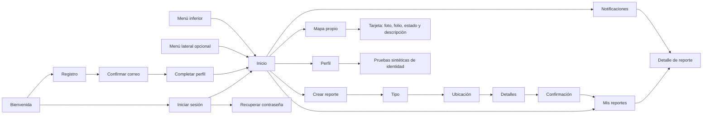
```mermaid
flowchart LR
 W[Bienvenida] --> L[Iniciar sesión]
 W --> R[Registro]
 R --> C[Confirmar correo]
 C --> P[Completar perfil]
 L --> H[Inicio]
 P --> H
 L --> Reset[Recuperar contraseña]
 H --> Reports[Mis reportes]
 H --> Create[Crear reporte]
 H --> Map[Mapa propio]
 H --> Profile[Perfil]
 H --> N[Notificaciones]
 Create --> Type[Tipo] --> Location[Ubicación] --> Details[Detalles] --> Confirm[Confirmación]
 Confirm --> Reports
 Reports --> Detail[Detalle de reporte]
 N --> Detail
 Map --> Preview[Tarjeta: foto, folio, estado y descripción]
 Profile --> Identity[Pruebas sintéticas de identidad]
 Drawer[Menú lateral opcional] --> H
 Bottom[Menú inferior] --> H
```

## 21. Selección de ubicación

GPS real pendiente de validar en el navegador del usuario. Una dirección escrita no se geocodifica automáticamente.

Fuente: `report_wizard.dart; report_map.dart; report_address_location.sql`.

```mermaid
flowchart TD
 A[Entrar a ubicación] --> B[Mapa visible centrado en Cuautla sin punto enviado]
 B --> C{Elección del ciudadano}
 C -->|Dirección| D[Guardar texto de dirección]
 C -->|Tocar mapa| E[Seleccionar punto]
 C -->|Usar ubicación| F[Solicitar ubicación con precisión media]
 F --> G{Respuesta antes de 20 segundos}
 G -->|Sí| E
 G -->|No o permiso denegado| H[Mostrar error sin bloquear formulario]
 H --> C
 E --> I[Mostrar marcador y precisión si proviene de GPS]
 I --> J[Verificar o ajustar punto]
 D --> K{Requisito de ubicación satisfecho}
 J --> K
 K -->|Punto o dirección de al menos 10 caracteres| L[Continuar]
 K -->|No| C
```

## 22. Flujo de datos de nivel 1

No es una topología de red; separa procesos y almacenes. Las flechas no conceden acceso directo a tablas.

Fuente: `supabase/functions; supabase/migrations`.

```mermaid
flowchart LR
 C[Ciudadano] --> P1[1 Autenticación y perfil]
 P1 <--> D1[(Auth y perfiles)]
 C --> P2[2 Captura de reporte]
 P2 --> D2[(Reportes, imágenes e historial)]
 P2 --> D3[(Objetos privados)]
 A[Personal autorizado] --> P3[3 Gestión y asignación]
 P3 <--> D2
 P3 --> D4[(Auditoría)]
 D2 --> P4[4 Generar avisos]
 P4 --> D5[(Notificaciones)]
 D5 --> P5[5 Consultar avisos propios]
 P5 --> C
 C --> P6[6 Identidad sintética]
 P6 --> D6[(Consentimientos y verificaciones)]
 P6 --> D3
```

## 23. Límites de confianza

No contiene secretos. RLS y validaciones de funciones cumplen papeles distintos; service_role exige comprobaciones explícitas de servidor.

Fuente: `supabase/functions; docs/seguridad.md`.

```mermaid
flowchart TB
 subgraph U[Cliente no confiable]
 UI[Flutter / panel]
 Data[Datos, IDs y versión enviados]
 UI --> Data
 end
 subgraph G[Entrada validada]
 Auth[Auth valida JWT]
 Edge[Edge valida método, origen, tamaño y contenido]
 RPC[RPC valida sesión y permisos]
 end
 subgraph DB[Persistencia protegida]
 RLS[RLS + concesiones SQL]
 FK[FK compuestas con municipio]
 Tables[(Tablas de aplicación)]
 Storage[(Buckets privados)]
 end
 Data --> Auth --> Edge --> RPC
 Data -->|RPC con JWT| RPC
 RPC --> RLS --> Tables
 RPC --> FK --> Tables
 Edge -->|solo tras autorización| Storage
```

## 24. Colaboración y validación

Flujo recomendado para colaboradores; CI es una plantilla manual, no una automatización activa.

Fuente: `CONTRIBUTING.md; docs/ci/database-workflow.yml`.

```mermaid
flowchart LR
 R[Repositorio privado main] --> B[Crear rama]
 B --> C[Configurar entorno local con plantillas]
 C --> D[Desarrollar cambio]
 D --> F[Flutter analyze y test]
 D --> N[Typecheck y build del panel]
 D --> S[SQL syntax y pgTAP local]
 F --> PR[Pull request]
 N --> PR
 S --> PR
 PR --> Review[Revisión por colaboradores]
 Review --> Merge[Integración autorizada]
 Merge --> R
 CI[Plantilla CI manual / no activa] -. opcional con permisos y cuota .-> Review
```

## 25. Modelo entidad-relación general

Vista de claves. Relaciones físicas FK; no dibuja como FK las rutas de Storage ni IDs polimórficos. Las FK compuestas se muestran como una sola relación.

Fuente: `Todas las migraciones; schema.json`.

```mermaid
erDiagram
  auth_users {
    uuid id PK
  }
  public_municipalities {
    uuid id PK "required"
  }
  public_profiles {
    uuid id PK, FK "required"
    uuid municipality_id FK "required"
  }
  public_roles {
    uuid id PK "required"
    text code UK "required"
  }
  public_permissions {
    uuid id PK "required"
    text code UK "required"
  }
  public_role_permissions {
    uuid role_id PK, FK "required"
    uuid permission_id PK, FK "required"
  }
  public_user_roles {
    uuid id PK "required"
    uuid user_id FK "required"
    uuid municipality_id FK "nullable"
    uuid role_id FK "required"
  }
  public_priorities {
    uuid id PK "required"
    uuid municipality_id FK "required"
  }
  public_report_statuses {
    uuid id PK "required"
    text code UK "required"
  }
  public_departments {
    uuid id PK "required"
    uuid municipality_id FK "required"
  }
  public_zones {
    uuid id PK "required"
    uuid municipality_id FK "required"
  }
  public_categories {
    uuid id PK "required"
    uuid municipality_id FK "required"
    uuid default_priority_id FK "required"
  }
  public_subcategories {
    uuid id PK "required"
    uuid municipality_id FK "required"
    uuid category_id FK "required"
  }
  public_settings {
    uuid municipality_id PK, FK "required"
  }
  public_consents {
    uuid id PK "required"
    uuid municipality_id FK "required"
    uuid user_id FK "required"
  }
  public_identity_verifications {
    uuid id PK "required"
    uuid municipality_id FK "required"
    uuid user_id FK "required"
    uuid consent_id FK "nullable"
  }
  public_reports {
    uuid id PK "required"
    text folio UK "required"
    uuid municipality_id FK "required"
    uuid citizen_id FK "required"
    uuid category_id FK "required"
    uuid subcategory_id FK "nullable"
    uuid priority_id FK "required"
    uuid status_id FK "required"
    uuid zone_id FK "nullable"
  }
  public_report_images {
    uuid id PK "required"
    uuid municipality_id FK "required"
    uuid report_id FK "required"
    text storage_path UK "required"
  }
  public_report_status_history {
    uuid id PK "required"
    uuid municipality_id FK "required"
    uuid report_id FK "required"
    uuid previous_status_id FK "nullable"
    uuid new_status_id FK "required"
    uuid changed_by FK "nullable"
  }
  public_report_assignments {
    uuid id PK "required"
    uuid municipality_id FK "required"
    uuid report_id FK "required"
    uuid department_id FK "required"
    uuid assigned_to FK "nullable"
    uuid assigned_by FK "nullable"
  }
  public_report_comments {
    uuid id PK "required"
    uuid municipality_id FK "required"
    uuid report_id FK "required"
    uuid author_id FK "nullable"
  }
  public_notifications {
    uuid id PK "required"
    uuid municipality_id FK "required"
    uuid user_id FK "required"
    uuid report_id FK "nullable"
  }
  public_audit_logs {
    uuid id PK "required"
    uuid municipality_id FK "required"
    uuid actor_id FK "nullable"
  }
  public_sla_rules {
    uuid id PK "required"
    uuid municipality_id FK "required"
    uuid category_id FK "nullable"
    uuid priority_id FK "required"
  }
  private_identity_documents {
    uuid verification_id PK, FK "required"
    text side PK "required"
    text storage_path UK "required"
  }
  private_report_uploads {
    uuid id PK "required"
    uuid actor FK "required"
    uuid municipality_id FK "required"
  }
  auth_users ||--o| public_profiles : "id"
  public_municipalities ||--o{ public_profiles : "municipality_id"
  public_roles ||--o{ public_role_permissions : "role_id"
  public_permissions ||--o{ public_role_permissions : "permission_id"
  public_profiles ||--o{ public_user_roles : "user_id"
  public_municipalities |o--o{ public_user_roles : "municipality_id"
  public_roles ||--o{ public_user_roles : "role_id"
  public_profiles |o--o{ public_user_roles : "user_id, municipality_id"
  public_municipalities ||--o{ public_priorities : "municipality_id"
  public_municipalities ||--o{ public_departments : "municipality_id"
  public_municipalities ||--o{ public_zones : "municipality_id"
  public_municipalities ||--o{ public_categories : "municipality_id"
  public_priorities ||--o{ public_categories : "default_priority_id, municipality_id"
  public_municipalities ||--o{ public_subcategories : "municipality_id"
  public_categories ||--o{ public_subcategories : "category_id, municipality_id"
  public_municipalities ||--o| public_settings : "municipality_id"
  public_municipalities ||--o{ public_consents : "municipality_id"
  public_profiles ||--o{ public_consents : "user_id, municipality_id"
  public_municipalities ||--o{ public_identity_verifications : "municipality_id"
  public_profiles ||--o{ public_identity_verifications : "user_id, municipality_id"
  public_consents |o--o{ public_identity_verifications : "consent_id"
  public_municipalities ||--o{ public_reports : "municipality_id"
  public_report_statuses ||--o{ public_reports : "status_id"
  public_profiles ||--o{ public_reports : "citizen_id, municipality_id"
  public_categories ||--o{ public_reports : "category_id, municipality_id"
  public_subcategories |o--o{ public_reports : "subcategory_id, category_id, municipality_id"
  public_priorities ||--o{ public_reports : "priority_id, municipality_id"
  public_zones |o--o{ public_reports : "zone_id, municipality_id"
  public_municipalities ||--o{ public_report_images : "municipality_id"
  public_reports ||--o{ public_report_images : "report_id, municipality_id"
  public_municipalities ||--o{ public_report_status_history : "municipality_id"
  public_report_statuses |o--o{ public_report_status_history : "previous_status_id"
  public_report_statuses ||--o{ public_report_status_history : "new_status_id"
  public_profiles |o--o{ public_report_status_history : "changed_by"
  public_reports ||--o{ public_report_status_history : "report_id, municipality_id"
  public_municipalities ||--o{ public_report_assignments : "municipality_id"
  public_profiles |o--o{ public_report_assignments : "assigned_by"
  public_reports ||--o{ public_report_assignments : "report_id, municipality_id"
  public_departments ||--o{ public_report_assignments : "department_id, municipality_id"
  public_profiles |o--o{ public_report_assignments : "assigned_to, municipality_id"
  public_municipalities ||--o{ public_report_comments : "municipality_id"
  public_profiles |o--o{ public_report_comments : "author_id"
  public_reports ||--o{ public_report_comments : "report_id, municipality_id"
  public_municipalities ||--o{ public_notifications : "municipality_id"
  public_profiles ||--o{ public_notifications : "user_id, municipality_id"
  public_reports |o--o{ public_notifications : "report_id, municipality_id"
  public_municipalities ||--o{ public_audit_logs : "municipality_id"
  public_profiles |o--o{ public_audit_logs : "actor_id"
  public_municipalities ||--o{ public_sla_rules : "municipality_id"
  public_categories |o--o{ public_sla_rules : "category_id, municipality_id"
  public_priorities ||--o{ public_sla_rules : "priority_id, municipality_id"
  public_identity_verifications ||--o{ private_identity_documents : "verification_id"
  public_profiles ||--o{ private_report_uploads : "actor"
  public_municipalities ||--o{ private_report_uploads : "municipality_id"
```

## 26. Identidad de usuario y permisos

Columnas completas de las tablas seleccionadas. PK/FK son participaciones de columnas en claves; ver schema.json para claves compuestas y diccionario para restricciones.

Fuente: `Todas las migraciones; schema.json`.

```mermaid
erDiagram
  auth_users {
    uuid id PK
  }
  public_municipalities {
    uuid id PK "required"
    text name "required"
    text state "required"
    text logo_url "nullable"
    bool is_active "required"
    timestamptz created_at "required"
    timestamptz updated_at "required"
  }
  public_profiles {
    uuid id PK, FK "required"
    uuid municipality_id FK "required"
    text first_name "required"
    text last_name "required"
    text phone "nullable"
    public_identity_status identity_status "required"
    bool is_active "required"
    timestamptz created_at "required"
    timestamptz updated_at "required"
    timestamptz deleted_at "nullable"
  }
  public_roles {
    uuid id PK "required"
    text code UK "required"
    text description "required"
  }
  public_permissions {
    uuid id PK "required"
    text code UK "required"
    text description "required"
  }
  public_role_permissions {
    uuid role_id PK, FK "required"
    uuid permission_id PK, FK "required"
  }
  public_user_roles {
    uuid id PK "required"
    uuid user_id FK "required"
    uuid municipality_id FK "nullable"
    uuid role_id FK "required"
    timestamptz created_at "required"
  }
  auth_users ||--o| public_profiles : "id"
  public_municipalities ||--o{ public_profiles : "municipality_id"
  public_roles ||--o{ public_role_permissions : "role_id"
  public_permissions ||--o{ public_role_permissions : "permission_id"
  public_profiles ||--o{ public_user_roles : "user_id"
  public_municipalities |o--o{ public_user_roles : "municipality_id"
  public_roles ||--o{ public_user_roles : "role_id"
  public_profiles |o--o{ public_user_roles : "user_id, municipality_id"
```

## 27. Catálogos y configuración

Columnas completas de las tablas seleccionadas. PK/FK son participaciones de columnas en claves; ver schema.json para claves compuestas y diccionario para restricciones.

Fuente: `Todas las migraciones; schema.json`.

```mermaid
erDiagram
  public_municipalities {
    uuid id PK "required"
    text name "required"
    text state "required"
    text logo_url "nullable"
    bool is_active "required"
    timestamptz created_at "required"
    timestamptz updated_at "required"
  }
  public_priorities {
    uuid id PK "required"
    uuid municipality_id FK "required"
    text name "required"
    int2 rank "required"
    bool is_active "required"
  }
  public_categories {
    uuid id PK "required"
    uuid municipality_id FK "required"
    text name "required"
    text description "nullable"
    text icon "nullable"
    uuid default_priority_id FK "required"
    bool requires_photo "required"
    bool requires_location "required"
    bool is_public "required"
    bool is_active "required"
    int4 sort_order "required"
    jsonb dynamic_form_schema "required"
    timestamptz created_at "required"
    timestamptz updated_at "required"
  }
  public_subcategories {
    uuid id PK "required"
    uuid municipality_id FK "required"
    uuid category_id FK "required"
    text name "required"
    bool is_active "required"
    int4 sort_order "required"
  }
  public_departments {
    uuid id PK "required"
    uuid municipality_id FK "required"
    text name "required"
    bool is_active "required"
    timestamptz created_at "required"
    timestamptz updated_at "required"
  }
  public_zones {
    uuid id PK "required"
    uuid municipality_id FK "required"
    text name "required"
    extensions_geometry boundary "required"
  }
  public_settings {
    uuid municipality_id PK, FK "required"
    int4 identity_retention_days "nullable"
    int4 evidence_retention_days "nullable"
    text privacy_notice_version "nullable"
    text privacy_notice_url "nullable"
    text emergency_contact "nullable"
    int2 max_report_images "required"
    timestamptz updated_at "required"
    bool citizen_registration_enabled "required"
    bool pilot_reports_enabled "required"
  }
  public_sla_rules {
    uuid id PK "required"
    uuid municipality_id FK "required"
    uuid category_id FK "nullable"
    uuid priority_id FK "required"
    int4 response_minutes "required"
    int4 resolution_minutes "required"
    bool is_active "required"
  }
  public_municipalities ||--o{ public_priorities : "municipality_id"
  public_municipalities ||--o{ public_categories : "municipality_id"
  public_priorities ||--o{ public_categories : "default_priority_id, municipality_id"
  public_municipalities ||--o{ public_subcategories : "municipality_id"
  public_categories ||--o{ public_subcategories : "category_id, municipality_id"
  public_municipalities ||--o{ public_departments : "municipality_id"
  public_municipalities ||--o{ public_zones : "municipality_id"
  public_municipalities ||--o| public_settings : "municipality_id"
  public_municipalities ||--o{ public_sla_rules : "municipality_id"
  public_categories |o--o{ public_sla_rules : "category_id, municipality_id"
  public_priorities ||--o{ public_sla_rules : "priority_id, municipality_id"
```

## 28. Reportes y seguimiento

Columnas completas de las tablas seleccionadas. PK/FK son participaciones de columnas en claves; ver schema.json para claves compuestas y diccionario para restricciones.

Fuente: `Todas las migraciones; schema.json`.

```mermaid
erDiagram
  public_municipalities {
    uuid id PK "required"
    text name "required"
    text state "required"
    text logo_url "nullable"
    bool is_active "required"
    timestamptz created_at "required"
    timestamptz updated_at "required"
  }
  public_profiles {
    uuid id PK, FK "required"
    uuid municipality_id FK "required"
    text first_name "required"
    text last_name "required"
    text phone "nullable"
    public_identity_status identity_status "required"
    bool is_active "required"
    timestamptz created_at "required"
    timestamptz updated_at "required"
    timestamptz deleted_at "nullable"
  }
  public_categories {
    uuid id PK "required"
    uuid municipality_id FK "required"
    text name "required"
    text description "nullable"
    text icon "nullable"
    uuid default_priority_id FK "required"
    bool requires_photo "required"
    bool requires_location "required"
    bool is_public "required"
    bool is_active "required"
    int4 sort_order "required"
    jsonb dynamic_form_schema "required"
    timestamptz created_at "required"
    timestamptz updated_at "required"
  }
  public_subcategories {
    uuid id PK "required"
    uuid municipality_id FK "required"
    uuid category_id FK "required"
    text name "required"
    bool is_active "required"
    int4 sort_order "required"
  }
  public_priorities {
    uuid id PK "required"
    uuid municipality_id FK "required"
    text name "required"
    int2 rank "required"
    bool is_active "required"
  }
  public_report_statuses {
    uuid id PK "required"
    text code UK "required"
    text name "required"
    bool is_terminal "required"
  }
  public_zones {
    uuid id PK "required"
    uuid municipality_id FK "required"
    text name "required"
    extensions_geometry boundary "required"
  }
  public_reports {
    uuid id PK "required"
    text folio UK "required"
    uuid municipality_id FK "required"
    uuid citizen_id FK "required"
    uuid category_id FK "required"
    uuid subcategory_id FK "nullable"
    uuid priority_id FK "required"
    uuid status_id FK "required"
    uuid zone_id FK "nullable"
    text description "required"
    extensions_geography location "nullable"
    text approximate_address "nullable"
    numeric gps_accuracy "nullable"
    timestamptz captured_at "nullable"
    jsonb additional_data "required"
    jsonb form_schema_snapshot "required"
    uuid idempotency_key "required"
    timestamptz created_at "required"
    timestamptz updated_at "required"
    timestamptz resolved_at "nullable"
    timestamptz closed_at "nullable"
    bool is_pilot "required"
    int8 admin_version "required"
  }
  public_report_images {
    uuid id PK "required"
    uuid municipality_id FK "required"
    uuid report_id FK "required"
    text storage_path UK "required"
    text mime_type "required"
    int8 size "required"
    timestamptz created_at "required"
  }
  public_report_status_history {
    uuid id PK "required"
    uuid municipality_id FK "required"
    uuid report_id FK "required"
    uuid previous_status_id FK "nullable"
    uuid new_status_id FK "required"
    uuid changed_by FK "nullable"
    text comment "nullable"
    timestamptz created_at "required"
  }
  public_report_assignments {
    uuid id PK "required"
    uuid municipality_id FK "required"
    uuid report_id FK "required"
    uuid department_id FK "required"
    uuid assigned_to FK "nullable"
    uuid assigned_by FK "nullable"
    timestamptz assigned_at "required"
    timestamptz unassigned_at "nullable"
  }
  public_departments {
    uuid id PK "required"
    uuid municipality_id FK "required"
    text name "required"
    bool is_active "required"
    timestamptz created_at "required"
    timestamptz updated_at "required"
  }
  public_report_comments {
    uuid id PK "required"
    uuid municipality_id FK "required"
    uuid report_id FK "required"
    uuid author_id FK "nullable"
    text body "required"
    bool is_internal "required"
    timestamptz created_at "required"
  }
  public_municipalities ||--o{ public_profiles : "municipality_id"
  public_municipalities ||--o{ public_categories : "municipality_id"
  public_priorities ||--o{ public_categories : "default_priority_id, municipality_id"
  public_municipalities ||--o{ public_subcategories : "municipality_id"
  public_categories ||--o{ public_subcategories : "category_id, municipality_id"
  public_municipalities ||--o{ public_priorities : "municipality_id"
  public_municipalities ||--o{ public_zones : "municipality_id"
  public_municipalities ||--o{ public_reports : "municipality_id"
  public_report_statuses ||--o{ public_reports : "status_id"
  public_profiles ||--o{ public_reports : "citizen_id, municipality_id"
  public_categories ||--o{ public_reports : "category_id, municipality_id"
  public_subcategories |o--o{ public_reports : "subcategory_id, category_id, municipality_id"
  public_priorities ||--o{ public_reports : "priority_id, municipality_id"
  public_zones |o--o{ public_reports : "zone_id, municipality_id"
  public_municipalities ||--o{ public_report_images : "municipality_id"
  public_reports ||--o{ public_report_images : "report_id, municipality_id"
  public_municipalities ||--o{ public_report_status_history : "municipality_id"
  public_report_statuses |o--o{ public_report_status_history : "previous_status_id"
  public_report_statuses ||--o{ public_report_status_history : "new_status_id"
  public_profiles |o--o{ public_report_status_history : "changed_by"
  public_reports ||--o{ public_report_status_history : "report_id, municipality_id"
  public_municipalities ||--o{ public_report_assignments : "municipality_id"
  public_profiles |o--o{ public_report_assignments : "assigned_by"
  public_reports ||--o{ public_report_assignments : "report_id, municipality_id"
  public_departments ||--o{ public_report_assignments : "department_id, municipality_id"
  public_profiles |o--o{ public_report_assignments : "assigned_to, municipality_id"
  public_municipalities ||--o{ public_departments : "municipality_id"
  public_municipalities ||--o{ public_report_comments : "municipality_id"
  public_profiles |o--o{ public_report_comments : "author_id"
  public_reports ||--o{ public_report_comments : "report_id, municipality_id"
```

## 29. Verificación sintética y consentimiento

Columnas completas de las tablas seleccionadas. PK/FK son participaciones de columnas en claves; ver schema.json para claves compuestas y diccionario para restricciones.

Fuente: `Todas las migraciones; schema.json`.

```mermaid
erDiagram
  public_municipalities {
    uuid id PK "required"
    text name "required"
    text state "required"
    text logo_url "nullable"
    bool is_active "required"
    timestamptz created_at "required"
    timestamptz updated_at "required"
  }
  public_profiles {
    uuid id PK, FK "required"
    uuid municipality_id FK "required"
    text first_name "required"
    text last_name "required"
    text phone "nullable"
    public_identity_status identity_status "required"
    bool is_active "required"
    timestamptz created_at "required"
    timestamptz updated_at "required"
    timestamptz deleted_at "nullable"
  }
  public_consents {
    uuid id PK "required"
    uuid municipality_id FK "required"
    uuid user_id FK "required"
    text consent_type "required"
    text privacy_notice_version "required"
    timestamptz accepted_at "required"
  }
  public_identity_verifications {
    uuid id PK "required"
    uuid municipality_id FK "required"
    uuid user_id FK "required"
    text provider "nullable"
    text provider_reference "nullable"
    text document_type "required"
    public_identity_status status "required"
    jsonb verification_metadata "required"
    timestamptz created_at "required"
    timestamptz updated_at "required"
    timestamptz verified_at "nullable"
    timestamptz rejected_at "nullable"
    timestamptz expires_at "nullable"
    timestamptz document_delete_after "nullable"
    timestamptz documents_deleted_at "nullable"
    bool is_synthetic "required"
    uuid consent_id FK "nullable"
    uuid request_key "nullable"
  }
  private_identity_documents {
    uuid verification_id PK, FK "required"
    text side PK "required"
    text storage_path UK "required"
    timestamptz uploaded_at "nullable"
    timestamptz deleted_at "nullable"
  }
  public_municipalities ||--o{ public_profiles : "municipality_id"
  public_municipalities ||--o{ public_consents : "municipality_id"
  public_profiles ||--o{ public_consents : "user_id, municipality_id"
  public_municipalities ||--o{ public_identity_verifications : "municipality_id"
  public_profiles ||--o{ public_identity_verifications : "user_id, municipality_id"
  public_consents |o--o{ public_identity_verifications : "consent_id"
  public_identity_verifications ||--o{ private_identity_documents : "verification_id"
```

## 30. Avisos, auditoría y reservas

Columnas completas de las tablas seleccionadas. PK/FK son participaciones de columnas en claves; ver schema.json para claves compuestas y diccionario para restricciones.

Fuente: `Todas las migraciones; schema.json`.

```mermaid
erDiagram
  public_municipalities {
    uuid id PK "required"
    text name "required"
    text state "required"
    text logo_url "nullable"
    bool is_active "required"
    timestamptz created_at "required"
    timestamptz updated_at "required"
  }
  public_profiles {
    uuid id PK, FK "required"
    uuid municipality_id FK "required"
    text first_name "required"
    text last_name "required"
    text phone "nullable"
    public_identity_status identity_status "required"
    bool is_active "required"
    timestamptz created_at "required"
    timestamptz updated_at "required"
    timestamptz deleted_at "nullable"
  }
  public_reports {
    uuid id PK "required"
    text folio UK "required"
    uuid municipality_id FK "required"
    uuid citizen_id FK "required"
    uuid category_id FK "required"
    uuid subcategory_id FK "nullable"
    uuid priority_id FK "required"
    uuid status_id FK "required"
    uuid zone_id FK "nullable"
    text description "required"
    extensions_geography location "nullable"
    text approximate_address "nullable"
    numeric gps_accuracy "nullable"
    timestamptz captured_at "nullable"
    jsonb additional_data "required"
    jsonb form_schema_snapshot "required"
    uuid idempotency_key "required"
    timestamptz created_at "required"
    timestamptz updated_at "required"
    timestamptz resolved_at "nullable"
    timestamptz closed_at "nullable"
    bool is_pilot "required"
    int8 admin_version "required"
  }
  public_notifications {
    uuid id PK "required"
    uuid municipality_id FK "required"
    uuid user_id FK "required"
    uuid report_id FK "nullable"
    text title "required"
    text body "required"
    timestamptz read_at "nullable"
    timestamptz created_at "required"
  }
  public_audit_logs {
    uuid id PK "required"
    uuid municipality_id FK "required"
    uuid actor_id FK "nullable"
    text action "required"
    text entity_type "required"
    uuid entity_id "nullable"
    jsonb old_values "required"
    jsonb new_values "required"
    jsonb metadata "required"
    timestamptz created_at "required"
  }
  private_report_uploads {
    uuid id PK "required"
    uuid actor FK "required"
    uuid municipality_id FK "required"
    uuid request_key "required"
    jsonb payload "required"
    timestamptz created_at "required"
    timestamptz expires_at "required"
    timestamptz committed_at "nullable"
    timestamptz purged_at "nullable"
  }
  public_municipalities ||--o{ public_profiles : "municipality_id"
  public_municipalities ||--o{ public_reports : "municipality_id"
  public_profiles ||--o{ public_reports : "citizen_id, municipality_id"
  public_municipalities ||--o{ public_notifications : "municipality_id"
  public_profiles ||--o{ public_notifications : "user_id, municipality_id"
  public_reports |o--o{ public_notifications : "report_id, municipality_id"
  public_municipalities ||--o{ public_audit_logs : "municipality_id"
  public_profiles |o--o{ public_audit_logs : "actor_id"
  public_profiles ||--o{ private_report_uploads : "actor"
  public_municipalities ||--o{ private_report_uploads : "municipality_id"
```

## 31. public.municipalities

Ficha de columnas completa. Para relaciones, consultar los diagramas ER por área y el diccionario.

Fuente: `supabase/migrations/20260919000826_phase1_schema.sql`.

```mermaid
erDiagram
  public_municipalities {
    uuid id PK "required"
    text name "required"
    text state "required"
    text logo_url "nullable"
    bool is_active "required"
    timestamptz created_at "required"
    timestamptz updated_at "required"
  }
```

## 32. public.profiles

Ficha de columnas completa. Para relaciones, consultar los diagramas ER por área y el diccionario.

Fuente: `supabase/migrations/20260919000826_phase1_schema.sql`.

```mermaid
erDiagram
  public_profiles {
    uuid id PK, FK "required"
    uuid municipality_id FK "required"
    text first_name "required"
    text last_name "required"
    text phone "nullable"
    public_identity_status identity_status "required"
    bool is_active "required"
    timestamptz created_at "required"
    timestamptz updated_at "required"
    timestamptz deleted_at "nullable"
  }
```

## 33. public.roles

Ficha de columnas completa. Para relaciones, consultar los diagramas ER por área y el diccionario.

Fuente: `supabase/migrations/20260919000826_phase1_schema.sql`.

```mermaid
erDiagram
  public_roles {
    uuid id PK "required"
    text code UK "required"
    text description "required"
  }
```

## 34. public.permissions

Ficha de columnas completa. Para relaciones, consultar los diagramas ER por área y el diccionario.

Fuente: `supabase/migrations/20260919000826_phase1_schema.sql`.

```mermaid
erDiagram
  public_permissions {
    uuid id PK "required"
    text code UK "required"
    text description "required"
  }
```

## 35. public.role_permissions

Ficha de columnas completa. Para relaciones, consultar los diagramas ER por área y el diccionario.

Fuente: `supabase/migrations/20260919000826_phase1_schema.sql`.

```mermaid
erDiagram
  public_role_permissions {
    uuid role_id PK, FK "required"
    uuid permission_id PK, FK "required"
  }
```

## 36. public.user_roles

Ficha de columnas completa. Para relaciones, consultar los diagramas ER por área y el diccionario.

Fuente: `supabase/migrations/20260919000826_phase1_schema.sql`.

```mermaid
erDiagram
  public_user_roles {
    uuid id PK "required"
    uuid user_id FK "required"
    uuid municipality_id FK "nullable"
    uuid role_id FK "required"
    timestamptz created_at "required"
  }
```

## 37. public.priorities

Ficha de columnas completa. Para relaciones, consultar los diagramas ER por área y el diccionario.

Fuente: `supabase/migrations/20260919000826_phase1_schema.sql`.

```mermaid
erDiagram
  public_priorities {
    uuid id PK "required"
    uuid municipality_id FK "required"
    text name "required"
    int2 rank "required"
    bool is_active "required"
  }
```

## 38. public.report_statuses

Ficha de columnas completa. Para relaciones, consultar los diagramas ER por área y el diccionario.

Fuente: `supabase/migrations/20260919000826_phase1_schema.sql`.

```mermaid
erDiagram
  public_report_statuses {
    uuid id PK "required"
    text code UK "required"
    text name "required"
    bool is_terminal "required"
  }
```

## 39. public.departments

Ficha de columnas completa. Para relaciones, consultar los diagramas ER por área y el diccionario.

Fuente: `supabase/migrations/20260919000826_phase1_schema.sql`.

```mermaid
erDiagram
  public_departments {
    uuid id PK "required"
    uuid municipality_id FK "required"
    text name "required"
    bool is_active "required"
    timestamptz created_at "required"
    timestamptz updated_at "required"
  }
```

## 40. public.zones

Ficha de columnas completa. Para relaciones, consultar los diagramas ER por área y el diccionario.

Fuente: `supabase/migrations/20260919000826_phase1_schema.sql`.

```mermaid
erDiagram
  public_zones {
    uuid id PK "required"
    uuid municipality_id FK "required"
    text name "required"
    extensions_geometry boundary "required"
  }
```

## 41. public.categories

Ficha de columnas completa. Para relaciones, consultar los diagramas ER por área y el diccionario.

Fuente: `supabase/migrations/20260919000826_phase1_schema.sql`.

```mermaid
erDiagram
  public_categories {
    uuid id PK "required"
    uuid municipality_id FK "required"
    text name "required"
    text description "nullable"
    text icon "nullable"
    uuid default_priority_id FK "required"
    bool requires_photo "required"
    bool requires_location "required"
    bool is_public "required"
    bool is_active "required"
    int4 sort_order "required"
    jsonb dynamic_form_schema "required"
    timestamptz created_at "required"
    timestamptz updated_at "required"
  }
```

## 42. public.subcategories

Ficha de columnas completa. Para relaciones, consultar los diagramas ER por área y el diccionario.

Fuente: `supabase/migrations/20260919000826_phase1_schema.sql`.

```mermaid
erDiagram
  public_subcategories {
    uuid id PK "required"
    uuid municipality_id FK "required"
    uuid category_id FK "required"
    text name "required"
    bool is_active "required"
    int4 sort_order "required"
  }
```

## 43. public.settings

Ficha de columnas completa. Para relaciones, consultar los diagramas ER por área y el diccionario.

Fuente: `supabase/migrations/20260919000826_phase1_schema.sql`.

```mermaid
erDiagram
  public_settings {
    uuid municipality_id PK, FK "required"
    int4 identity_retention_days "nullable"
    int4 evidence_retention_days "nullable"
    text privacy_notice_version "nullable"
    text privacy_notice_url "nullable"
    text emergency_contact "nullable"
    int2 max_report_images "required"
    timestamptz updated_at "required"
    bool citizen_registration_enabled "required"
    bool pilot_reports_enabled "required"
  }
```

## 44. public.consents

Ficha de columnas completa. Para relaciones, consultar los diagramas ER por área y el diccionario.

Fuente: `supabase/migrations/20260919000826_phase1_schema.sql`.

```mermaid
erDiagram
  public_consents {
    uuid id PK "required"
    uuid municipality_id FK "required"
    uuid user_id FK "required"
    text consent_type "required"
    text privacy_notice_version "required"
    timestamptz accepted_at "required"
  }
```

## 45. public.identity_verifications

Ficha de columnas completa. Para relaciones, consultar los diagramas ER por área y el diccionario.

Fuente: `supabase/migrations/20260919000826_phase1_schema.sql`.

```mermaid
erDiagram
  public_identity_verifications {
    uuid id PK "required"
    uuid municipality_id FK "required"
    uuid user_id FK "required"
    text provider "nullable"
    text provider_reference "nullable"
    text document_type "required"
    public_identity_status status "required"
    jsonb verification_metadata "required"
    timestamptz created_at "required"
    timestamptz updated_at "required"
    timestamptz verified_at "nullable"
    timestamptz rejected_at "nullable"
    timestamptz expires_at "nullable"
    timestamptz document_delete_after "nullable"
    timestamptz documents_deleted_at "nullable"
    bool is_synthetic "required"
    uuid consent_id FK "nullable"
    uuid request_key "nullable"
  }
```

## 46. public.reports

Ficha de columnas completa. Para relaciones, consultar los diagramas ER por área y el diccionario.

Fuente: `supabase/migrations/20260919000826_phase1_schema.sql`.

```mermaid
erDiagram
  public_reports {
    uuid id PK "required"
    text folio UK "required"
    uuid municipality_id FK "required"
    uuid citizen_id FK "required"
    uuid category_id FK "required"
    uuid subcategory_id FK "nullable"
    uuid priority_id FK "required"
    uuid status_id FK "required"
    uuid zone_id FK "nullable"
    text description "required"
    extensions_geography location "nullable"
    text approximate_address "nullable"
    numeric gps_accuracy "nullable"
    timestamptz captured_at "nullable"
    jsonb additional_data "required"
    jsonb form_schema_snapshot "required"
    uuid idempotency_key "required"
    timestamptz created_at "required"
    timestamptz updated_at "required"
    timestamptz resolved_at "nullable"
    timestamptz closed_at "nullable"
    bool is_pilot "required"
    int8 admin_version "required"
  }
```

## 47. public.report_images

Ficha de columnas completa. Para relaciones, consultar los diagramas ER por área y el diccionario.

Fuente: `supabase/migrations/20260919000826_phase1_schema.sql`.

```mermaid
erDiagram
  public_report_images {
    uuid id PK "required"
    uuid municipality_id FK "required"
    uuid report_id FK "required"
    text storage_path UK "required"
    text mime_type "required"
    int8 size "required"
    timestamptz created_at "required"
  }
```

## 48. public.report_status_history

Ficha de columnas completa. Para relaciones, consultar los diagramas ER por área y el diccionario.

Fuente: `supabase/migrations/20260919000826_phase1_schema.sql`.

```mermaid
erDiagram
  public_report_status_history {
    uuid id PK "required"
    uuid municipality_id FK "required"
    uuid report_id FK "required"
    uuid previous_status_id FK "nullable"
    uuid new_status_id FK "required"
    uuid changed_by FK "nullable"
    text comment "nullable"
    timestamptz created_at "required"
  }
```

## 49. public.report_assignments

Ficha de columnas completa. Para relaciones, consultar los diagramas ER por área y el diccionario.

Fuente: `supabase/migrations/20260919000826_phase1_schema.sql`.

```mermaid
erDiagram
  public_report_assignments {
    uuid id PK "required"
    uuid municipality_id FK "required"
    uuid report_id FK "required"
    uuid department_id FK "required"
    uuid assigned_to FK "nullable"
    uuid assigned_by FK "nullable"
    timestamptz assigned_at "required"
    timestamptz unassigned_at "nullable"
  }
```

## 50. public.report_comments

Ficha de columnas completa. Para relaciones, consultar los diagramas ER por área y el diccionario.

Fuente: `supabase/migrations/20260919000826_phase1_schema.sql`.

```mermaid
erDiagram
  public_report_comments {
    uuid id PK "required"
    uuid municipality_id FK "required"
    uuid report_id FK "required"
    uuid author_id FK "nullable"
    text body "required"
    bool is_internal "required"
    timestamptz created_at "required"
  }
```

## 51. public.notifications

Ficha de columnas completa. Para relaciones, consultar los diagramas ER por área y el diccionario.

Fuente: `supabase/migrations/20260919000826_phase1_schema.sql`.

```mermaid
erDiagram
  public_notifications {
    uuid id PK "required"
    uuid municipality_id FK "required"
    uuid user_id FK "required"
    uuid report_id FK "nullable"
    text title "required"
    text body "required"
    timestamptz read_at "nullable"
    timestamptz created_at "required"
  }
```

## 52. public.audit_logs

Ficha de columnas completa. Para relaciones, consultar los diagramas ER por área y el diccionario.

Fuente: `supabase/migrations/20260919000826_phase1_schema.sql`.

```mermaid
erDiagram
  public_audit_logs {
    uuid id PK "required"
    uuid municipality_id FK "required"
    uuid actor_id FK "nullable"
    text action "required"
    text entity_type "required"
    uuid entity_id "nullable"
    jsonb old_values "required"
    jsonb new_values "required"
    jsonb metadata "required"
    timestamptz created_at "required"
  }
```

## 53. public.sla_rules

Ficha de columnas completa. Para relaciones, consultar los diagramas ER por área y el diccionario.

Fuente: `supabase/migrations/20260919000826_phase1_schema.sql`.

```mermaid
erDiagram
  public_sla_rules {
    uuid id PK "required"
    uuid municipality_id FK "required"
    uuid category_id FK "nullable"
    uuid priority_id FK "required"
    int4 response_minutes "required"
    int4 resolution_minutes "required"
    bool is_active "required"
  }
```

## 54. private.identity_documents

Ficha de columnas completa. Para relaciones, consultar los diagramas ER por área y el diccionario.

Fuente: `supabase/migrations/20260924170343_phase3_synthetic_identity.sql`.

```mermaid
erDiagram
  private_identity_documents {
    uuid verification_id PK, FK "required"
    text side PK "required"
    text storage_path UK "required"
    timestamptz uploaded_at "nullable"
    timestamptz deleted_at "nullable"
  }
```

## 55. private.report_uploads

Ficha de columnas completa. Para relaciones, consultar los diagramas ER por área y el diccionario.

Fuente: `supabase/migrations/20260925174611_phase4_pilot_reports.sql`.

```mermaid
erDiagram
  private_report_uploads {
    uuid id PK "required"
    uuid actor FK "required"
    uuid municipality_id FK "required"
    uuid request_key "required"
    jsonb payload "required"
    timestamptz created_at "required"
    timestamptz expires_at "required"
    timestamptz committed_at "nullable"
    timestamptz purged_at "nullable"
  }
```
